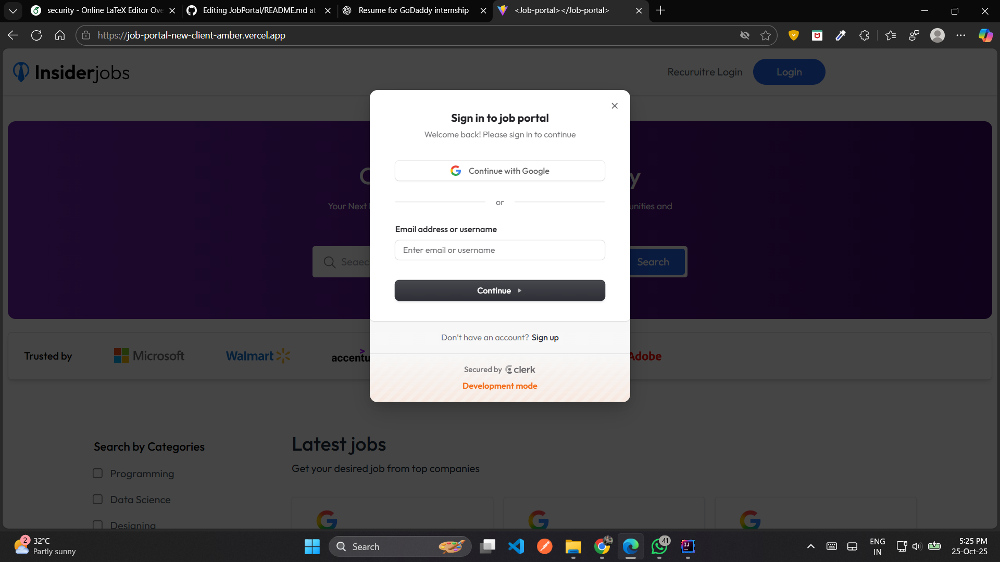

# Job Portal Web Application

**Live Demo:** [Job Portal](https://job-portal-new-client-amber.vercel.app/)

## Overview
This is a **full-stack job portal web application** built using **React.js, Node.js, MongoDB, and Clerk**. The platform allows recruiters to post job opportunities and candidates to apply, with a focus on **secure authentication, role-based access control, and scalable backend services**.

## Features
- **Role-Based Access Control:** Separate roles for recruiters and candidates with customized permissions.  
- **Authentication & Authorization:** Secure login and signup using **Clerk**.  
- **Dynamic Job Listings:** Recruiters can post jobs, and candidates can view and apply in real-time.  
- **Backend & Database:** Built with **Node.js** and **MongoDB** for efficient storage and retrieval of job and user data.  
- **Scalable RESTful APIs:** Designed to handle multiple concurrent users and real-time application tracking.  
- **Responsive UI:** Frontend built with **React.js** for a seamless user experience across devices.

## Tech Stack
- **Frontend:** React.js  
- **Backend:** Node.js, Express.js  
- **Database:** MongoDB  
- **Authentication:** Clerk  
- **APIs:** RESTful APIs  
- **Deployment:** Vercel  

## Screenshots
  
  


## Future Enhancements
- Add **email notifications** for recruiters and candidates.  
- Integrate **advanced search and filtering** for job listings.  
- Implement **analytics dashboard** for recruiters to track applications.  

## How to Run Locally
1. Clone the repository:
```bash
git clone https://github.com/Dinkar18/JobPortal.git
